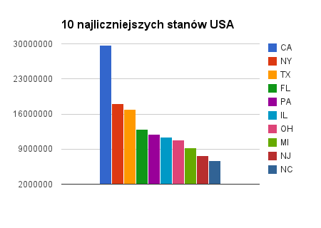

### *Daniel Landowski*

# Oczyszczanie danych

Kody pocztowe wg powiatów dla województwa pomorskiego.

## Krok po kroku

1. Pobrać dane. [link](http://pl.wikisource.org/wiki/Lista_kod%C3%B3w_pocztowych_w_Polsce/Powiaty/Wojew%C3%B3dztwo_pomorskie)
2. Pobrać Google Refine. [link](https://code.google.com/p/google-refine/wiki/Downloads?tm=2)
3. Oczyścić oraz posortować dane przy pomocy Google Refine.
4. Wyeksportować powyższe dane do pliku csv przy pomocy Google Refine.

## Pliki

1. [oryginalne dane](/data/csv/dlandows-kody-pocztowe.txt)
2. [plik csv](/data/csv/dlandows-kody-pocztowe.csv)

## Przykładowe dane

```csv
kod_pocztowy,miasto,powiat,oddzial,adres
89-650,Czersk,chojnicki,Poczta Czersk,nie podano
```

# Agregacje

## Przygotowanie

Pobrać dane:
```
wget http://media.mongodb.org/zips.json
wget https://raw.github.com/wiki/mongodb/mongo-ruby-driver/data/name_days.json
```

Zaimportować do bazy:
```
mongoimport --drop -d test -c zipcodes zips.json
mongoimport --drop -d test -c cal name_days.json
```

## Agregacje w konsoli
### Najliczniejszy stan w USA:
```js
coll = db.zipcodes

coll.aggregate(
    { $group: {_id: "$state", totalPop: {$sum: "$pop"}} },
    { $sort: {totalPop: -1} },
    { $limit: 1}
)
```

####Rezultat:
```json
{
    "result" : [
    	{
			"_id" : "CA",
			"totalPop" : 29760021
		}
	],
	"ok" : 1
}
```


### Imieniny, które świętowane są dokładnie 6 razy w roku:
```js
coll = db.cal

coll.aggregate(
    { $project: {names: 1, _id: 0} },
    { $unwind: "$names" },
    { $group: {_id: "$names", count: {$sum: 1}} },
    { $match: {count: {$lte: 6, $gte: 6}}}
)
```

#### Rezultat:
```json
{
    "result" : [
		{
			"_id" : "Wincentego",
			"count" : 6
		},
		{
			"_id" : "Filipa",
			"count" : 6
		},
		{
			"_id" : "Tomasza",
			"count" : 6
		},
		{
			"_id" : "Szymona",
			"count" : 6
		},
		{
			"_id" : "Anieli",
			"count" : 6
		},
		{
			"_id" : "Antoniego",
			"count" : 6
		},
		{
			"_id" : "Ireny",
			"count" : 6
		},
		{
			"_id" : "Bogdana",
			"count" : 6
		},
		{
			"_id" : "Seweryna",
			"count" : 6
		}
	],
	"ok" : 1
}
```

### Ile razy w roku obchodzone są imieniny Daniela:
```js
coll = db.cal

coll.aggregate(
    { $project: {names: 1, _id: 0} },
    { $unwind: "$names" },
    { $match: { names: "Daniela"}},
    { $group: {_id: "$names", count: {$sum: 1}}}
)
```

#### Rezultat:
```json
{ 
    "result" : [ 
        { 
            "_id" : "Daniela",
            "count" : 3
        } 
    ], 
    "ok" : 1 
}
```

